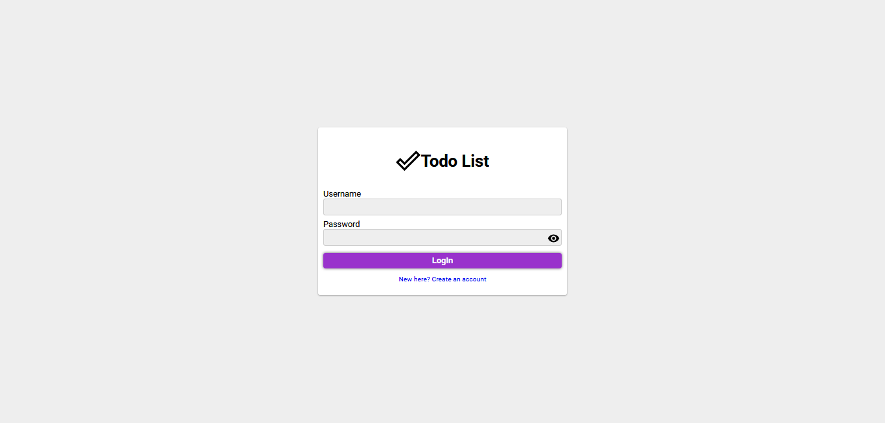
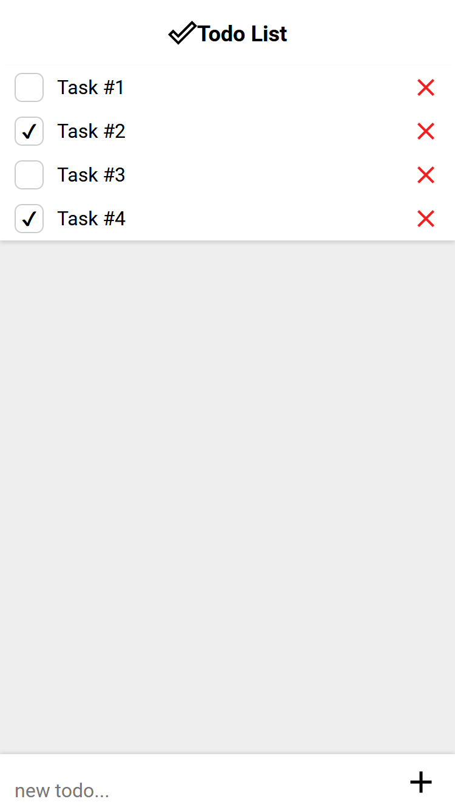
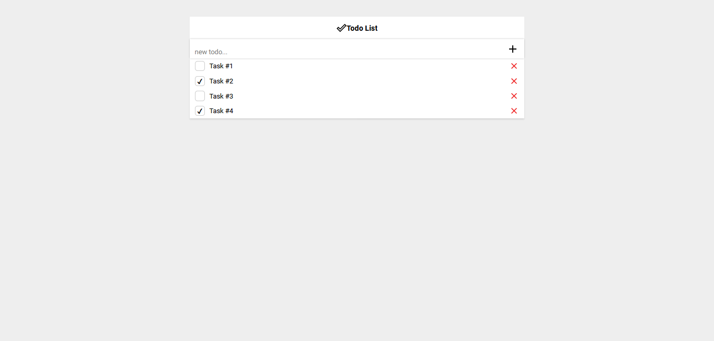

# Todo List

Todo list web app built with [ASP.NET Core](https://docs.microsoft.com/en-us/aspnet/core/?view=aspnetcore-3.1),
[ReactJS](https://reactjs.org/) and [SQL Server](https://www.microsoft.com/en-us/sql-server)

<table>
    <tbody>
        <tr>
            <td></td>
            <td rowspan=2></td>
        </tr>
        <tr>
            <td></td>
        </tr>
    </tbody>
</table>

<p align="center">
 <a href="#technologies">Technologies</a> •
 <a href="#getting-started">Getting started</a> •
 <a href="#run-with-docker">Run with docker</a> •
 <a href="#run-without-docker">Run without docker</a>
</p>

## Technologies

-   [Docker](https://www.docker.com/): Platform to build, run, and share applications with containers.
-   Backend
    -   [ASP NET Core](https://docs.microsoft.com/en-us/aspnet/core/?view=aspnetcore-3.1): Cross-platform framework to build web apps
    -   [SQL Server](https://www.microsoft.com/en-us/sql-server): Microsoft Relational Database
    -   [Dapper](https://dapper-tutorial.net/dapper): Micro ORM
    -   Tests
        -   [xUnit](https://xunit.net/): Unit testing tool for the .NET
        -   [Fluent Assertions](https://fluentassertions.com/): Fluent API for asserting the results of unit tests
        -   [Moq](https://github.com/moq/moq): Mocking framework for .NET
-   Frontend
    -   [ReactJS](https://reactjs.org/): JavaScript library for building user interfaces
    -   [Typescript](https://www.typescriptlang.org/): Typed superset of JavaScript
    -   [React Router DOM](https://reacttraining.com/react-router/web/guides/quick-start): Declarative routing for React

# Getting started

### Clone

Clone this repository

```
git clone https://github.com/fernandovmp/todo-list
```

Then, change to repository folder

```
cd todo-list
```

### Run with docker

Requires

-   [Docker](https://docs.docker.com/get-docker/)
-   [Docker compose](https://docs.docker.com/compose/install/)

Run the following command to start database, backend and frontend

```
docker-compose up -d
```

ASP.NET Core API will be available in `http://localhost:5000`
ReactJS app will be available in `http://localhost:3000`

To stop the application run

```
docker-compose down
```

### Run without docker

Requires

-   [SQL SERVER](https://www.microsoft.com/en-us/sql-server/sql-server-downloads)
-   [.NET Core 3.1 SDK](https://dotnet.microsoft.com/download)
-   [NodeJS](https://nodejs.org/en/)

**Run the Web Api**

First, restore dependencies

```bash
$ dotnet restore
```

To run the tests

```
$ dotnet test
```

Add the following sections to `appsettings.json` located in ./src/TodoList.WebApi directory

```json
{
    "ConnectionStrings": {
        "SqlServerConnection": "CONNECTION STRING HERE"
    },
    "CorsOptions": {
        "PolicyName": "TodoApiPolicy",
        "AllowedOrigin": "http://localhost:3000"
    },
    "JwtToken": {
        "Audience": "TodoClient",
        "Issuer": "TodoApi",
        "Key": "KEY",
        "Seconds": 180
    }
}
```

Create database tables with the sql script located in ./database/scripts/init.sql

Then, run the project with with

```bash
$ dotnet run --project src/TodoList.WebApi
```

**Run the React app**

Fill the env file located in ./src/todo-list-spa with the api url:

```
REACT_APP_API_URL=http://localhost:5000
```

```bash
# Install dependencies
$ npm install --prefix src/todo-list-spa

# Starting the project
$ npm start --prefix src/todo-list-spa
```
